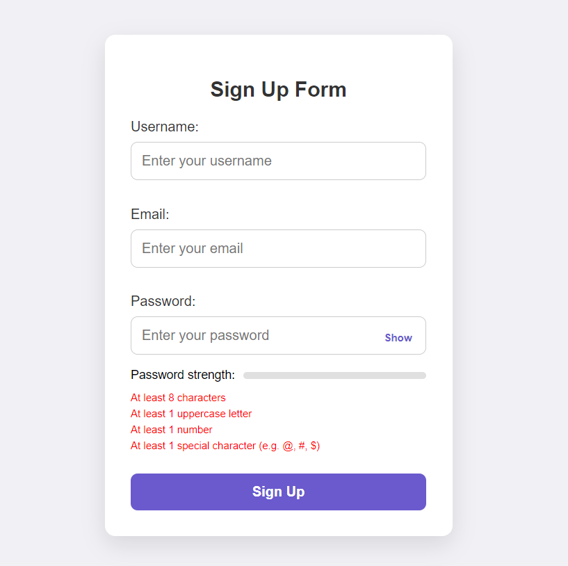
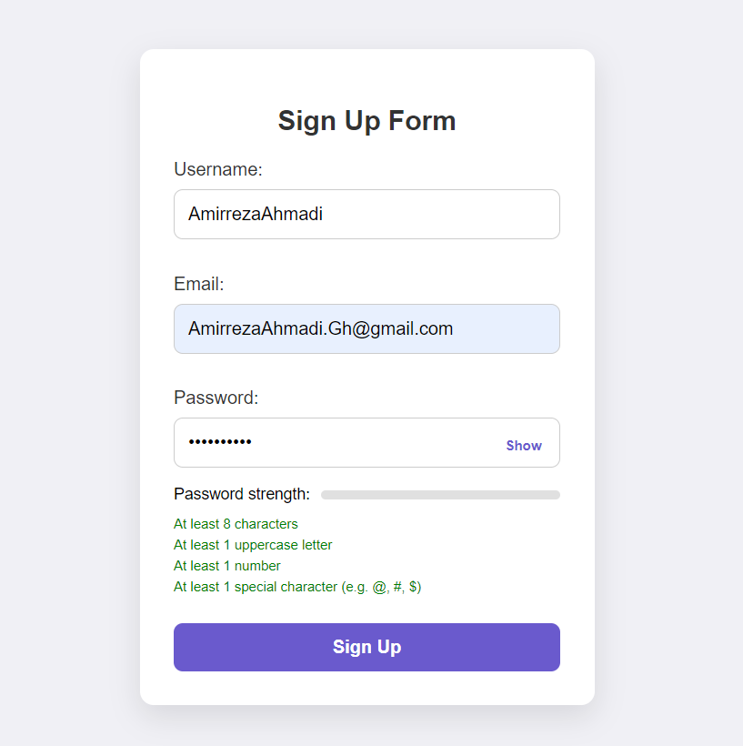

# Simple Sign Up Form

This project is a simple **Sign Up Form** application built with **pure JavaScript**, **HTML**, and **CSS**. It includes real-time validation of username, email, and password, and provides visual feedback on password strength. The project focuses on a clean, responsive design and emphasizes validation with plain JavaScript without any external libraries or frameworks.

## Table of Contents
- [ScreenShot](#screenshot)
- [Features](#features)
- [Built With](#built-with)
- [Prerequisites](#prerequisites)
- [Usage](#usage)
- [Contact](#contact)

## ScreenShot




<p align="right">(<a href="#table-of-contents">back to top</a>)</p>

## Features

- **Real-time Validation**: Username, email, and password are validated as the user types.
- **Password Strength Meter**: Indicates the strength of the entered password (Weak, Medium, Strong).
- **Password Show/Hide Toggle**: Allows users to toggle between showing and hiding the password.
- **Error Messages**: Displays user-friendly error messages for incorrect inputs.
- **Responsive Design**: Ensures compatibility across different screen sizes.

<p align="right">(<a href="#table-of-contents">back to top</a>)</p>

## Built With

This project was built using the following technologies:

* 
* 
* 

<p align="right">(<a href="#table-of-contents">back to top</a>)</p>

## Prerequisites

To run this project, all you need is a modern web browser that supports HTML, CSS, and JavaScript. There are **no additional libraries or dependencies** required, as the project is built with **pure JavaScript**.

<p align="right">(<a href="#table-of-contents">back to top</a>)</p>

## Usage

1. Clone the repository from GitHub or download the project files:
   ```bash
   git clone https://github.com/AmirrezaAhmadi/FormValidation-Vanilla-js.git

2. Open the FormValidation.html file in your browser.

<p align="right">(<a href="#table-of-contents">back to top</a>)</p>

## Contact

You can reach me through the following:

* Email: AmirrezaAhmadi.GH@Gmail.com
* Telegram: https://t.me/AmirrezaDevelop
* Instagram: https://www.instagram.com/codewithamirreza
* Project Link: https://github.com/AmirrezaAhmadi/FormValidation-Vanilla-js.git

<p align="right">(<a href="#table-of-contents">back to top</a>)</p>